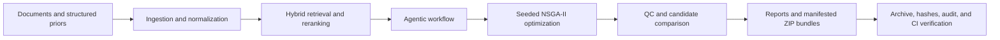

# Agentic RAG Codon Optimization Platform

A production-oriented research prototype for evidence-grounded, brain-region- and cell-type-aware gene-therapy CDS design.

## 3-Minute Project Summary

### Problem

Gene-therapy CDS design combines heterogeneous biological references, constrained sequence optimization, and quality-control evidence. The practical challenge is not only generating a candidate sequence, but also making every retrieved source, optimization decision, and exported result traceable and reproducible.

### Approach

This repository connects four layers in one auditable workflow:

1. **Evidence ingestion and retrieval** — PDF, Markdown, text, JSON, GTEx, Allen, and custom priors are normalized and searched with hybrid retrieval, alias expansion, facet-aware reranking, and source-priority scoring.
2. **Agentic orchestration** — planner, retriever, optimizer, and QC-writer roles preserve the workflow trace instead of returning an opaque one-shot answer.
3. **Constrained optimization** — a seeded NSGA-II optimizer explores synonymous CDS candidates while evaluating GC/CpG, motifs, splice/polyA signals, restriction sites, codon-pair, 5-prime GC, hairpin, and complexity constraints.
4. **Verification and provenance** — golden tests, API-contract checks, UI/API smoke tests, signed artifact bundles, provenance hashes, and preflight evidence make the result reviewable and reproducible.

### System Flow



### What to Review

| Review point | Repository evidence |
| --- | --- |
| Problem-solving scope | Evidence-grounded CDS design, retrieval, optimization, QC, and audit in one workflow |
| Backend and UI | FastAPI API and Next.js dashboard |
| Reproducibility | Seeded optimization, canonical configuration hashes, lockfiles, snapshots, and manifests |
| Quality validation | API contract, response/value golden tests, backend regression, frontend build, and browser smoke tests |
| Production readiness | Docker Compose, Postgres adapter, auth/rate-limit settings, readiness gates, operational audit, and deployment runbook |
| Deliverables | Markdown, HTML, JSON, and PDF reports plus hash-verified ZIP evidence bundles |

### Quick Verification

Run the complete evidence chain from the repository root:

```powershell
python scripts/preflight.py
python scripts/portfolio_readiness_matrix.py --strict
python scripts/final_portfolio_check.py --workflow .github/workflows/ci.yml --output-dir backend/app/data/runtime --output-json backend/app/data/runtime/final_portfolio_check.json
python scripts/verify_final_portfolio_check.py --path backend/app/data/runtime/final_portfolio_check.json
```

The CI workflow also compiles the backend, checks the OpenAPI contract, runs golden and regression tests, builds the frontend, exercises the browser path, validates signed artifacts, and checks the Docker Compose/Postgres deployment shape.

### Technology

- **Backend:** Python, FastAPI, Pydantic, SQLite/Postgres
- **Frontend:** Next.js, React, TypeScript, Playwright
- **Retrieval:** local JSON, optional pgvector/Qdrant, hash or OpenAI embeddings
- **Operations:** Docker Compose, GitHub Actions, SHA-256 manifests, optional HMAC signing

### Known Limitations

- Seed tRNA/codon-availability priors include explicit low-confidence or placeholder caveats and must not be treated as release-pinned quantitative data.
- Retrieval quality depends on the coverage and freshness of ingested documents and structured reference snapshots.
- Production use requires validated source-data refreshes, deployment secrets, and passing readiness/audit gates.

## Detailed Capabilities

- FastAPI backend for scoring, gene-to-CDS resolution, optimization, evidence retrieval, and QC report export.
- Next.js dashboard for target entry, candidate comparison, evidence review, QC summary, data provenance, source-snapshot coverage, and operational readiness.
- MANE-aware Ensembl transcript selection.
- Local document ingestion for PDF, Markdown, text, and JSON.
- Hybrid local RAG retrieval over seed evidence, ingested documents, and structured GTEx/Allen/CUSTOM priors, including alias expansion, facet-aware reranking, source-priority scoring, and retrieval coverage evaluation.
- RAG diagnostics for corpus/source distribution, reproducible chunking policy, token and embedding health, regression macro metrics, source-provenance regression evidence, weak-case surfacing, and operational recommendations.
- Manifested RAG evaluation ZIP bundles with retrieval trace, source provenance hashes, score CSV, retrieved chunks JSONL, RAG status, structured manifest, artifact verification, and semantic cross-checks.
- Data catalog and refresh API for reproducible GTEx/Allen reference panel ingestion.
- Data provenance and release-bundle audit for source hashes, dataset/source-file summary hashes, release metadata, RAG/document coverage, and refresh history.
- Production caveat tracking for low-confidence or placeholder tRNA/codon-availability priors so seed matrices cannot be mistaken for release-pinned quantitative data.
- Baseline audit recording for local seed/ingested data so reproducibility checks can start before a live external refresh.
- Data lockfile support for pinning and drift-checking a reproducible data/RAG/document state.
- Data release lockfile support for pinning structured dataset releases, file hashes, and release drift independently from runtime refresh state.
- Data release bundle verification in deployment readiness and production audit evidence, including required file, row-count, source-byte, and promotion-status checks.
- Data snapshot ZIP export and archived semantic verification for structured data, document extracts, RAG index, refresh log, manifests, external source snapshots, and artifact-level SHA-256 audit manifests.
- External source snapshot coverage and backfill controls for reproducible bundled/manual structured records.
- Seeded NSGA-II synonymous optimizer with repair and manufacturing-policy scoring for GC/CpG/motif/polyA/splice/restriction-site/codon-pair/5-prime-GC/hairpin/secondary-structure-proxy/complexity constraints.
- Optimizer diagnostics for objective inventory, benchmark quality bands, weak-case surfacing, and tuning recommendations.
- Manifested optimizer benchmark ZIP bundles with benchmark metrics, case provenance fingerprints, recommendation summary trade-off/Pareto evidence, recommended-candidate folding evidence, diagnostics, case catalog, candidate diagnostics, config snapshots, artifact verification, archive storage, readiness/audit evidence, and semantic cross-checks.
- ORF validation and QC gate checks for CDS inputs and recommended candidates.
- QC report bundles preserve recommended-candidate RNA folding/proxy evidence with stable hashes for archive and audit review.
- Candidate diagnostics for feasible-set counts, Pareto-front representatives, score ranges, codon-level diversity, and recommendation-audit trade-off regret against best-by-metric alternatives.
- Optimizer reproducibility manifests with canonical config hashes, score-config hashes, objective inventory, seed, repair policy, target hash, and source CDS hash.
- CUSTOM-style tissue-aware codon multipliers from structured priors.
- Markdown, HTML, JSON, and PDF QC report export.
- Manifested QC report ZIP bundles with JSON, Markdown, HTML, PDF, report-format summary hashes, candidate ranking CSV, provenance files, artifact verification, and semantic cross-checks for report and optimizer reproducibility metadata.
- SQLite run persistence with request/design/report/trace storage.
- Persistent agent memory index for session, semantic-rule, and artifact summaries derived from saved design runs.
- SQLite background job store for long-running single-gene design, batch gene design, and data refresh work.
- SQLite operational audit log for report/export/verify/job/data-refresh actions with actor hashes and request IDs.
- ZIP audit bundle export for persisted runs and background jobs, including file-level SHA-256 artifact manifests.
- Artifact verification endpoints for run, job, and data snapshot export bundles.
- Governance attestation export for OpenAPI, data, RAG, storage, and artifact-ledger state with hash verification.
- Production audit export for deployment readiness, security, storage, data provenance, RAG/optimizer diagnostics, QC/data snapshot archive semantics, governance verification, artifact-ledger state, and hash-pinned required action evidence.
- Optional Postgres runtime adapter for run/job/audit stores, with redacted `DATABASE_URL` status and migration DDL.
- SQLite-to-Postgres migration bundle export, dry-run import planning, and row-level source/target parity hashing.
- Immutable local artifact archive for exported run/job/data snapshot/QC report bundles with SHA-256 indexing, archive re-verification endpoints, and QC bundle semantic re-checks.
- Append-only artifact archive ledger with hash-chain verification for stored export history.
- Dry-run-first artifact retention cleanup with ledger tombstones for auditable archive pruning.
- External timestamp provider configuration evidence for regulated artifact archive promotion review.
- JSON and Prometheus-style metrics for request, run, job, RAG, and structured-data observability.
- Local agentic workflow orchestration for planner, retriever, optimizer, and QC writer roles.
- Docker Compose configuration for backend/frontend deployment.
- API shape and value-level golden fixtures for deterministic scoring, validation, optimization, and QC regression checks.

## Local Development

Backend:

```powershell
cd backend
pip install -r requirements.txt
python -m uvicorn app.main:app --reload --host 127.0.0.1 --port 8000
```

Optional environment:

```powershell
$env:APP_DATA_DIR = 'C:\path\to\persistent\data'
$env:CORS_ORIGINS = 'http://127.0.0.1:3000,http://127.0.0.1:3001'
$env:API_KEYS = 'replace-with-a-long-random-key'
$env:API_KEY_ROLES = 'replace-with-a-long-random-key=admin'
$env:RATE_LIMIT_PER_MINUTE = '120'
$env:ARTIFACT_SIGNING_KEY = 'replace-with-a-long-random-signing-secret'
$env:ARTIFACT_SIGNING_KEY_ID = 'local-hmac-sha256'
$env:ARTIFACT_RETENTION_DAYS = '0'
$env:ARTIFACT_RETENTION_KEEP_MIN = '100'
```

`API_KEYS` is optional and disabled by default for local development. When set, protected API routes accept either `X-API-Key: <key>` or `Authorization: Bearer <key>`. `API_KEY_ROLES` can map keys to `viewer`, `operator`, or `admin` roles using `key=admin;other=viewer,operator` or a JSON object. If roles are omitted, configured keys default to `admin` for backwards-compatible single-key deployments. For browser-based demos, set the matching `NEXT_PUBLIC_API_KEY` in the frontend environment.
`ARTIFACT_SIGNING_KEY` is optional. When set, exported run/job/data snapshot manifests are signed with HMAC-SHA256 and verify endpoints validate the signature.

For a production-style configuration, copy `.env.production.example`, replace every placeholder secret, set `STORAGE_BACKEND=postgres`, and confirm `/api/v1/deployment/readiness` has no `fail` gates before deployment.

Validate the production template or a filled production env file:

```powershell
python scripts/validate_production_env.py --template
python scripts/validate_production_env.py --path .env.production
python scripts/production_audit.py --template --skip-api
```

Frontend:

```powershell
cd frontend
npm install
npm run dev
```

Open `http://127.0.0.1:3001`.

## Docker

Docker is not installed in the current workspace environment, but deployment files are included:

```powershell
docker compose up --build
```

For a production-like Compose plan with Postgres, auth, retention, and artifact signing required:

```powershell
Copy-Item .env.production.example .env.production
python scripts/validate_production_env.py --path .env.production
python scripts/compose_preflight.py
docker compose --profile postgres --env-file .env.production -f docker-compose.yml -f docker-compose.production.yml up --build
```

Then open:

- Frontend: `http://127.0.0.1:3000`
- Backend docs: `http://127.0.0.1:8000/docs`

Runtime settings are available at `http://127.0.0.1:8000/api/v1/settings`.
Security status is available at `http://127.0.0.1:8000/api/v1/security/status`.
Operational audit summary is available at `http://127.0.0.1:8000/api/v1/audit/summary`.
Archived artifacts are available at `http://127.0.0.1:8000/api/v1/artifacts`.
Readiness is available at `http://127.0.0.1:8000/api/v1/health/ready`.
Reference data catalog is available at `http://127.0.0.1:8000/api/v1/data/catalog`, and the target-level live/seed coverage matrix is available at `http://127.0.0.1:8000/api/v1/data/coverage`.
Deployment notes are in `docs/DEPLOYMENT.md`.

## Verification

Run the full local preflight from the repository root:

```powershell
python scripts/preflight.py
python scripts/preflight.py --output-json backend/app/data/runtime/preflight_latest.json
```

The preflight compiles the backend, validates the production env template, checks Docker Compose deployment shape, checks the OpenAPI contract, verifies the structured import CLI preview path, verifies the GTEx/Allen data-refresh CLI planning and validation paths, runs response/value golden tests, runs the final portfolio evidence check and its verifier, runs the manual backend regression suite, builds the frontend, starts the backend and frontend if needed, runs the HTTP smoke test, runs a separate signed-artifact smoke profile with `ARTIFACT_SIGNING_KEY` enabled, and verifies the browser UI smoke path. The readiness smoke also verifies that tRNA/codon-availability seed caveats are exposed through the data provenance gate, and the artifact smoke checks indexed semantic summaries including workflow trace archives. Use `--skip-frontend`, `--skip-smoke`, `--skip-signing-smoke`, or `--skip-ui-smoke` for narrower diagnostics. `--output-json` writes a reproducible evidence file with timestamps, executed commands, durations, skipped checks, pass/fail status, compact stdout/stderr, parsed JSON details where commands emit JSON, `mode_hash`, `skipped_hash`, `checks_hash`, and `preflight_hash`; the production audit repeats those hashes in Markdown for promotion review.

For a deployment audit artifact, run:

```powershell
python scripts/production_audit.py --path .env.production --require-api
python scripts/production_audit.py --path .env.production --require-api --preflight-evidence backend/app/data/runtime/preflight_latest.json
python scripts/production_promotion_runbook.py --write-result backend/app/data/runtime/production_audit_write_result.json --output backend/app/data/runtime/production_promotion_runbook.md
```

This writes JSON and Markdown reports under `backend/app/data/runtime/production_audits`, combining production env validation, Compose checks, optional preflight evidence validation, and live operational API status when the backend is reachable. When `--preflight-evidence` is provided, the audit requires a passing, recent preflight payload with the expected backend, contract, data-refresh, golden, and regression checks.
The promotion runbook command accepts either the audit write-result or a `production_audit.json`, verifies the gap hashes, and groups remaining actions by operator environment, source-data promotion, artifact refresh, and optimizer validation scope.

Individual contract and golden checks are also available from the repository root:

```powershell
python scripts/portfolio_readiness_matrix.py --strict
python scripts/final_portfolio_check.py --workflow .github/workflows/ci.yml --output-dir backend/app/data/runtime --output-json backend/app/data/runtime/final_portfolio_check.json
python scripts/verify_final_portfolio_check.py --path backend/app/data/runtime/final_portfolio_check.json
python scripts/api_contract_test.py
python scripts/golden_response_test.py
python scripts/golden_value_test.py
```

`portfolio_readiness_matrix.py` emits a hash-pinned JSON evidence matrix for the PDF scope: real data ingestion, Agentic RAG retrieval/evaluation, multi-objective codon optimization, QC export, operator UI, deployment operations, and automated audit/CI coverage.
`final_portfolio_check.py` regenerates the matrix, CI production evidence chain, and portfolio submission summary artifacts, then records their SHA-256 values and payload hashes in `final_portfolio_check.json`; `verify_final_portfolio_check.py` recomputes those hashes before portfolio submission.

Backend smoke and manual regression checks can be run from `backend`:

```powershell
cd backend
python -c "from tests import test_optimizer as t; [getattr(t, name)() for name in dir(t) if name.startswith('test_')]; print('manual tests passed')"
python scripts/smoke_test.py
cd ..\frontend
npm.cmd run smoke:ui
```

Install `pytest` if you want standard test discovery.
